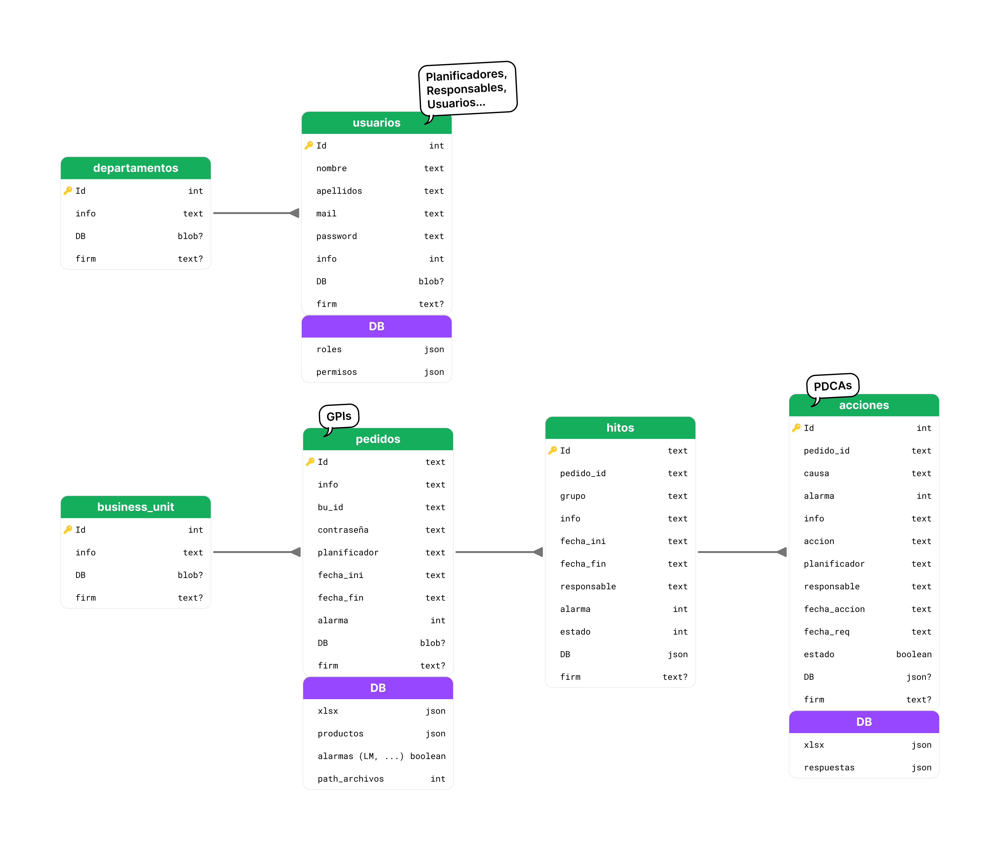

<!-- # PODUCTION MANAGER -->
<!--  
  -->

## DATA

 
 

## NOTAS DE DESARROLLO

- Al indicar paths, usar / barra mejor que contra barra \ por compatiblidad con MacOS/Linux.

    `assets\logo.svg --> assets/logo.svg`

- Todas las funciones u objetos relacionados con el frontend deben ir en `app.py`, mientras que todas las funciones y objetos relacionados con la data, calculo, o backend deben ir en `functions.py`

- Git:
    - Hacer commits indicando fecha y texto corto de cambios

        `2025.09.23 / Pedidos`
    - ...

## LINKS

- [FIGMA](https://www.figma.com/board/JhNFFjvvTGsrv902T1vfcU/PPI?node-id=0-1&t=nowQMEeaTUpbzTci-1)
- [STREAMLIT API](https://docs.streamlit.io/develop/api-reference)

 
 

## TAREAS

### ESTRUCTURA DE DATOS
- Implementar template Indra en hitos:
    
    `¿¿ Diseño, Lista de Materiales, Industrialización, PPI, Entrega ??`

### CAMINOS CRITICOS: 
    - Control de datos de entrada (Excel)
    - Extracción de SAP

### DESPLIEGUE
    - FASE1 (Server Pequeño) / SQLite, Streamlit
    - FASE2 / No definido